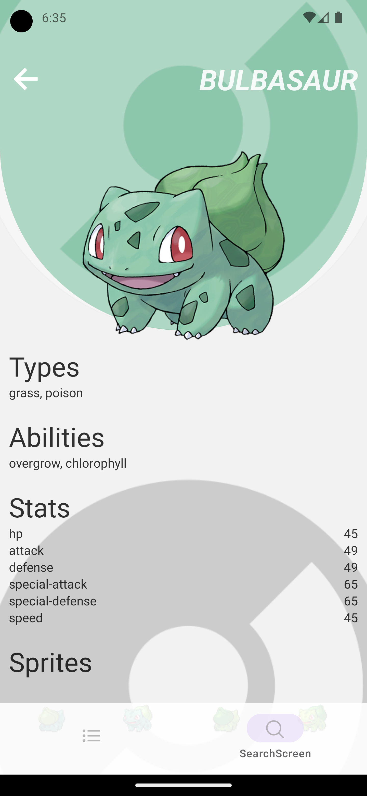

#  Pokedex React Native APP
React Native App to display and search pokemons in a beautiful UI.

# Compatibility
- IOS
- Android

# How to run?
`npm i`
`npm run start`

# Gallery
### Android

### IOS

